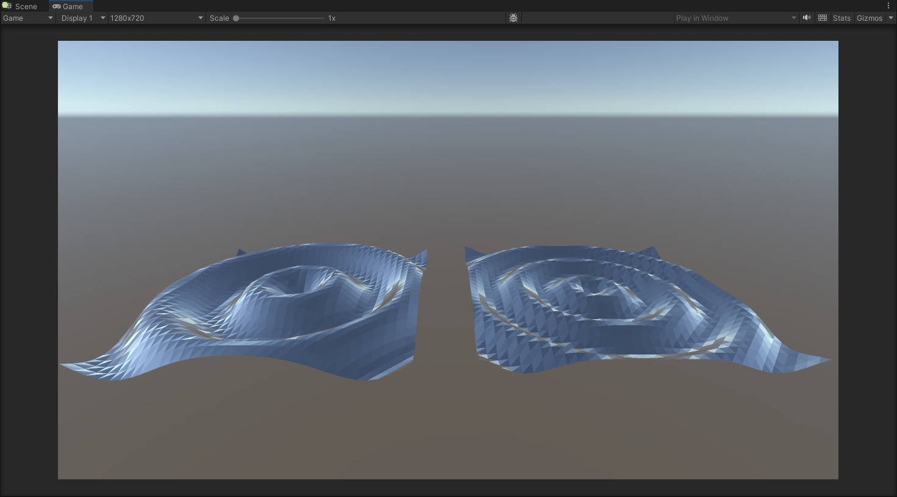

# RayTracingDynamicMeshGeometry
Unity sample project using dynamic Mesh geometries in a RayTracingAccelerationStructure (RTAS).

## Description
The project uses [RayTracingAccelerationStructure.AddInstance](https://docs.unity3d.com/2023.1/Documentation/ScriptReference/Rendering.RayTracingAccelerationStructure.AddInstance.html) function to add ray tracing instances that use dynamic geometries to the RTAS. The function signature used is:

`int AddInstance(ref Rendering.RayTracingMeshInstanceConfig config, Matrix4x4 matrix, Nullable<Matrix4x4> prevMatrix, uint id);`

There are 2 dynamic Meshes in the Scene - the left Mesh is animated on the CPU in C# while the right one on the GPU in a [compute shader](https://github.com/INedelcu/RayTracingDynamicMeshGeometry/blob/main/Assets/Shaders/WaveMeshAnimation.compute). Check [MeshInstanceDynamicGeometry.cs](https://github.com/INedelcu/RayTracingDynamicMeshGeometry/blob/main/Assets/Scripts/MeshInstanceDynamicGeometry.cs). After animation, [CommandBuffer.BuildRayTracingAccelerationStructure](https://docs.unity3d.com/2023.1/Documentation/ScriptReference/Rendering.CommandBuffer.BuildRayTracingAccelerationStructure.html) is called where the acceleration structures (BLAS) associated with the 2 geometries are generated on the GPU.

The raygeneration shader in [MeshInstanceDynamicGeometry.raytrace](https://github.com/INedelcu/RayTracingDynamicMeshGeometry/blob/main/Assets/Shaders/MeshInstanceDynamicGeometry.raytrace) casts the rays in the Scene calling [TraceRay](https://learn.microsoft.com/en-us/windows/win32/direct3d12/traceray-function) and generates the resulting image in a RenderTexture which is displayed in the Game View output.

The hit shader used by the 2 geometries is [MeshInstanceDynamicGeometry.shader](https://github.com/INedelcu/RayTracingDynamicMeshGeometry/blob/main/Assets/Shaders/MeshInstanceDynamicGeometry.shader), second SubShader.

After opening the project, switch to Game view and click Play.

## Prerequisites

* Windows 10 version 1809 and above.
* GPU supporting Ray Tracing ([SystemInfo.supportsRayTracing](https://docs.unity3d.com/2023.1/Documentation/ScriptReference/SystemInfo-supportsRayTracing.html) must be true).
* Unity 2023.1+.
